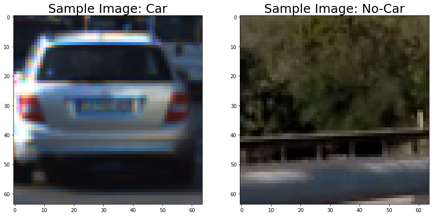

# Vehicle Detection

The goal of this project is to write a software pipeline to detect vehicles in a video (initially on test_video.mp4 with later implementation on the full project_video.mp4), along with a detailed writeup of the project approach and methodology.

---

**Vehicle Detection Project**

The goals / steps of this project are the following:

* Perform a Histogram of Oriented Gradients (HOG) feature extraction on a labeled training set of images and train a classifier Linear SVM classifier
* Apply a color transform and append binned color features, as well as histograms of color, to the HOG feature vector. 
* Note: for the first two steps, features for training and testing are normalized and randomized.
* Implementation of a sliding-window technique and application of trained classifier to search for vehicles in images.
* Run pipeline on a video stream (initially test_video.mp4, later on full project_video.mp4) and create a heat map of recurring detections frame by frame to reject outliers and follow detected vehicles.
* Estimate a bounding box for vehicles detected.

 #convert final video & save

[//]: # (Image References)

[im01]: ./examples/car_not_car.png
[im02]: ./examples/color_hist.png
[im03]: ./examples/bin_spatial.png
[im04]: ./examples/hog_features.png
[im05]: ./examples/window_search_small.png
[im06]: ./examples/window_search_mid.png
[im07]: ./examples/window_search_large.png 
[im08]: ./examples/pipeline_images.png 
[im09]: ./examples/heatmap.png 
[im10]: ./examples/labels.png 
[im11]: ./examples/final_out.png 
[im12]: ./examples/youtube_img.png # get from youtube cover img
[final]: ./examples/final.gif #convert final video & save

[video1]: ./project_video.mp4

## [Rubric](https://review.udacity.com/#!/rubrics/513/view) Points
### Here I will consider the rubric points individually and describe how I addressed each point in my implementation.  

---

### Histogram of Oriented Gradients (HOG)

#### 1. Explain how (and identify where in your code) you extracted HOG features from the training images.

The process of extracting HOG features from training images fell into the broader process of 'Feature Extraction' for the purpose of later training a Support Vector Machine (SVC) classifier.

First, I took a look at a sample image of each class and look at some general datapoints. Given that each class was roughly the same size, I decided not to do any additional data augmentation to match class sizes. Below, you can see a sample of each class.

 

The plan for creating a feature extractor was first to implement each component (color histogram, spatial features, and hog features), take a look at their output, then aggregate them into one function. This aggregate 'feature_extraction' function would allow me to include/exclude each component, and tweak their parameters when I moved on to training the SVC.

Color histogram was created first, with the `convert_color` and `color_hist` functions implemented in code cell 6. Below is an example of what the color histogram looks like across each color channel for the car and not-car classes.

The function to extract spatial features (`bin_spatial`) was defined in code cell 10. Below, you can see the plotted output of bin_spatial

[im03]: (examples/bin_spatial.png)

Finally, the HOG feature extractor was defined in cell 13 as get_hog_features(). The function returns the hog feature vector, in addition to optionally returning the hog_image as well. Below, you can see an example using the `RGB` color space and HOG parameters of `orientations=9`, `pixels_per_cell=(8, 8)` and `cells_per_block=(2, 2)`

[im04]: (examples/hog_features.png)

These components were aggregated into `extract_features` and `single_image_features` in cells 16/17 respectively. This wrapper function will allow us to easily toggle the parameters of each component as we train the SVC in the next section.

#### 2. Explain how you settled on your final choice of HOG parameters.

In order to settle on final feature extraction parameters, I iterated through a number of parameters for each component, and assessed the relative performance of each. Below you can see a table summarizing a number of tested configurations which yielded features to fit the SVC.

**_Feature Extraction Configuration_**

|Config|Colorspace|Spatial Size|Hist Bins|Orient|Pix/Cell|Cells/Block|Color Channel|HOG Channel|Spatial Feat|Hist Feat|HOG Feat|
|:-:| :-: |:-------:|:--:|:--:| :-: |:-:| :-: | :-: |  :-:  |  :-:  |  :-:  |
| 1 | YCrCb | (32,32) | 32 |  9 |  8  | 2 | ALL | ALL | False | False |  True |
| 2 | RGB | (32,32) | 32 |  9 |  8  | 2 | ALL | ALL | False | False |  True |
| 3 | HSV | (32,32) | 32 |  9 |  8  | 2 | ALL | ALL | False | False |  True |
| 4 | LAB | (32,32) | 32 |  9 |  8  | 2 | ALL | ALL | False | False |  True |
| 5 | LUV | (32,32) | 32 |  9 |  8  | 2 | ALL | ALL | False | False |  True |
| 6 | HLS | (32,32) | 32 |  9 |  8  | 2 | ALL | ALL | False | False |  True |
| 7 | YUV | (32,32) | 32 |  9 |  8  | 2 | ALL | ALL | False | False |  True |
| 8 | LUV | (32,32) | 32 |  9 |  8  | 2 | ALL | ALL | True | False |  True |
| 9 | LUV | (32,32) | 32 |  11 |  8  | 2 | ALL | ALL | True | True |  True |
| 10 | LUV | (32,32) | 32 |  11 |  8  | 2 | ALL | ALL | True | False |  True |

To assess each configuration, I looked at the time it took to extract features, scale them (normalization), train the SVC and make a prediction. I combined extraction, scaling and prediction to come up with the 'production' figure, because these will be what affect throughput when run on the video. 

Finally, I have the all-important accuracy figure, in addition to the 'efficiency' score, which I calculated by dividing the accuracy percentage by the 'production' number. This is meant to make it more obvious which configuration is best if you have several with high levels accuracy but varying production times. Put another way, it quantifies the tradeoff between accuracy and production time.

**_SVC Performance_**

|Config|Extraction|Scaling|Training|Prediction|Accuracy|Production|Efficiency|
|:-:| :---: |:----:|:----:|:-----:| :---: | :---: | :---: |
| 1 | 186.7 | 1.22 | 31.6 | 0.000 | 95.6% | 187.9 | 0.509 |
| 2 | 256.5 | 1.27 | 49.47 | 0.001 | 92.9 | 257.8 | 0.360 |
| 3 | 255.9 | 1.17 | 32.45 | 0.001 | 95.9% | 257.1 | 0.373 |
| 4 | 233.6 | 1.14 | 28.16 | 0.001 | 95.9% | 234.7 | 0.408 |
| 5 | 152.4 | 1.12 | 31.15 | 0.000 | 95.9% | 152.4 | 0.629 |
| 6 | 158.0 | 1.15 | 34.09 | 0.000 | 95.2% | 159.2 | 0.598 |
| 7 | 158.6 | 1.22 | 28.58 | 0.000 | 95.4% | 158.6 | 0.602 |
| 8 | 149.6 | 1.66 | 35.35 | 0.001 | 97.9% | 151.3 | 0.647 |
| 9 | 261.9 | 1.93 | 31.44 | 0.000 | 98.3% | 263.8 | 0.373 |
| 10 | 159.3 | 1.90 | 39.53 | 0.001 | 97.6% | 161.2 | 0.605 |

#### 3. Describe how (and identify where in your code) you trained a classifier using your selected HOG features (and color features if you used them).

The linear classifier was trained each time I went through an iteration of parameter testing (cells 18-23) in order to come up with the results outlined in the 'SVC Performance' table above. The steps are described at length in the code.

It is important that after all testing is done and a configuration is selected, the parameters in cell 18 are set to this configuration and the SVC is trained with them. 

As asafeguard, all the model data and parameters were saved in a pickle file and subsequently assigned to variables from the pickle file - just to be safe.

### Sliding Window Search

#### 1. Describe how (and identify where in your code) you implemented a sliding window search.  How did you decide what scales to search and how much to overlap windows?

The sliding window search was implemented via the `find_cars()` in cell 27. This function was effectively a wrapper/aggregator of functions/functionalities which were covered in the course material. In addition to generating the sliding window list, it calculates hog features for the area of interest - then subsamples this data when considering each window in the sliding window list. Features from these windows are fed into the trained SVC to output vehicle bounding boxes. 

Rather than an overlap value, cells_per_step defines overlap. In this case, it is set at 2, which relative to the 8 pix/cell amounts to 75% overlap.

Regarding setting bounding regions and window scaling, I set a flag  in `find_cars` which would output all sliding windows given bounding and scaling parameters. I drew these windows on the input image to test out various parameters for bounding regions and window scaling factors. Given the amount of overlap of the search windows, it is difficult to see the actual size of window. Because of this, I also created an image with a subset of the windows (every 25th image). You can see an example of the sliding search windows and search subset below.

[im05]: (examples/window_search_small.png)

[im06]: (examples/window_search_mid.png)

[im07]: (examples/window_search_large.png) 

#### 2. Show some examples of test images to demonstrate how your pipeline is working.  What did you do to optimize the performance of your classifier?

The final parameter set for feature extraction consisted of spatial features, all-channel histogram features and all-channel hog features in the LUV colorspace. Orientation, pix/cell and cell/block were 9/8/2 respectively. I decided to use 6 sets of search space parameters, ranging from close to distant. The heatmap and label layers helped a lot to reduce false positives, and eliminate overlapping boxes by converting the group into one box. Below, you can see how the pipeline worked for the 6 sample images.

[im08]: (examples/pipeline_images.png)
---

### Video Implementation

#### 1. Provide a link to your final video output.  Your pipeline should perform reasonably well on the entire project video (somewhat wobbly or unstable bounding boxes are ok as long as you are identifying the vehicles most of the time with minimal false positives.)

Here's a [link to my video result](./output_videos/project_video.mp4), or click the image above!

#### 2. Describe how (and identify where in your code) you implemented some kind of filter for false positives and some method for combining overlapping bounding boxes.

I recorded the positions of positive detections in each frame of the video.  From the positive detections I created a heatmap and then thresholded that map to identify vehicle positions.  I then used `scipy.ndimage.measurements.label()` to identify individual blobs in the heatmap.  I then assumed each blob corresponded to a vehicle.  I constructed bounding boxes to cover the area of each blob detected.  

Here's an example result showing the heatmap from each of the sample images, the result of `scipy.ndimage.measurements.label()` and the bounding boxes then overlaid on the original images:

### Here are frames and their corresponding heatmaps:

[im09]: (examples/heatmap.png) 

### Here is the output of `scipy.ndimage.measurements.label()` on the integrated heatmap from frames:
[im10]: (examples/labels.png)

### Here the resulting bounding boxes are drawn onto the last frame:
[im11]: (examples/final_out.png) 

---

### Discussion

#### 1. Briefly discuss any problems / issues you faced in your implementation of this project.  Where will your pipeline likely fail?  What could you do to make it more robust?

Here I'll talk about the approach I took, what techniques I used, what worked and why, where the pipeline might fail and how I might improve it if I were going to pursue this project further.  

Issues to look at/work on

Improve processing speed:
- improvements in feature extraction process - shrink the feature vector
- hog features are calculated for a region then subsampled, would it be worthwhile to do this with spatial features & color histogram data?

Other
- Is normalization working correctly? Chart of normalized features looks like there could be an issue. 

-Update find_cars to take xstart/stop as arguments

-More mix and match of feature extraction parameters might have afforded some improvement

-Add low-pass filter to make bounding boxes smoother

